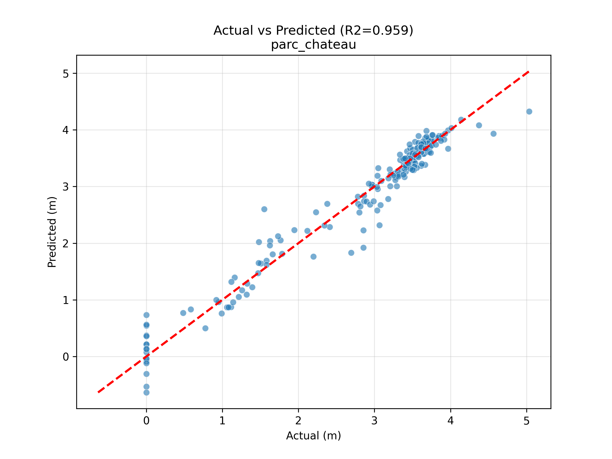
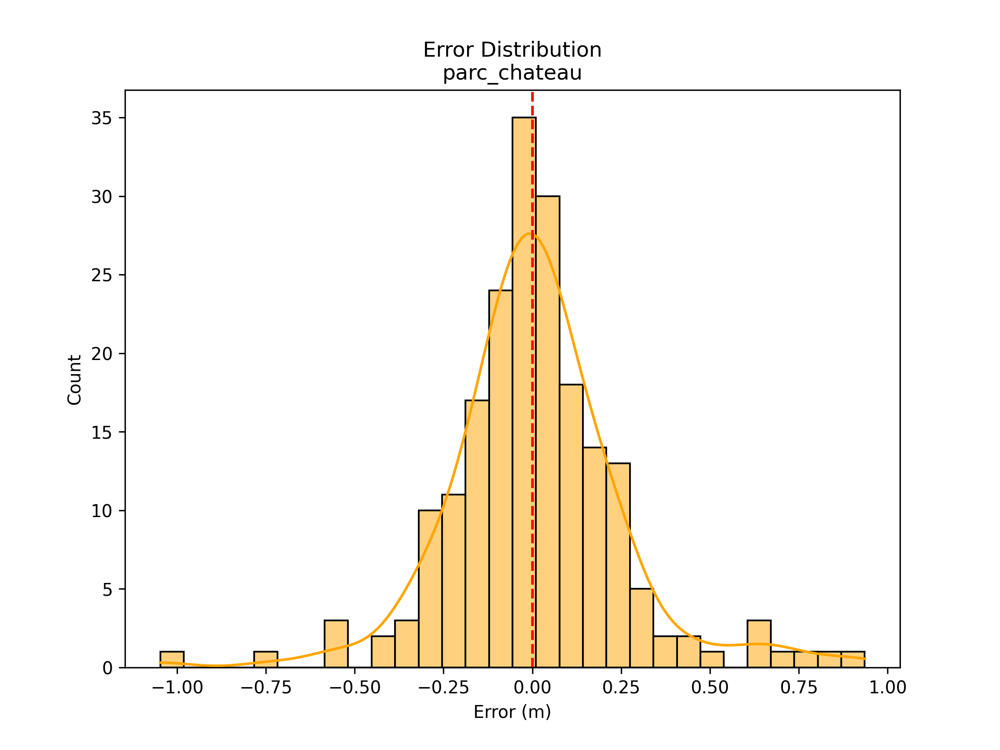
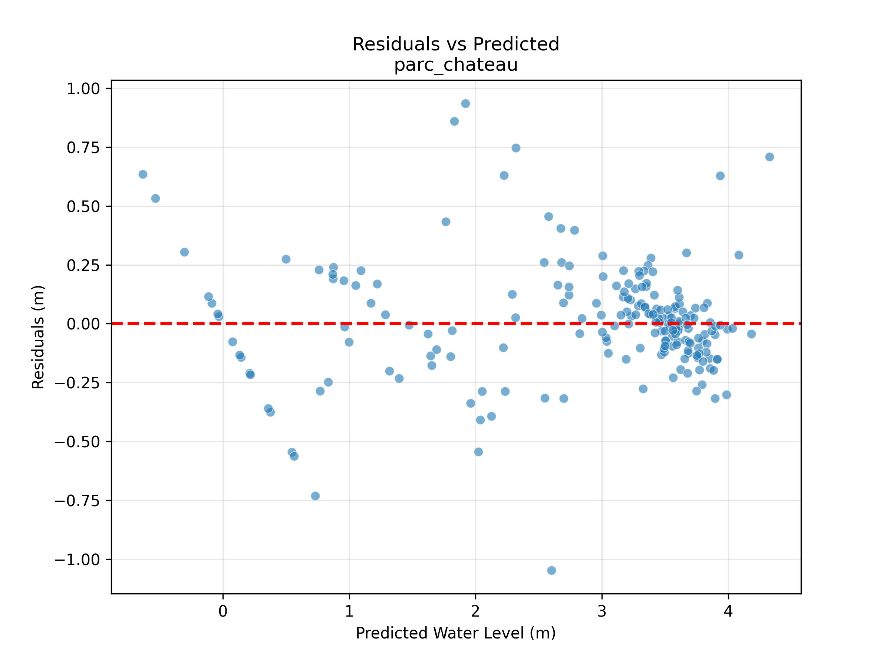
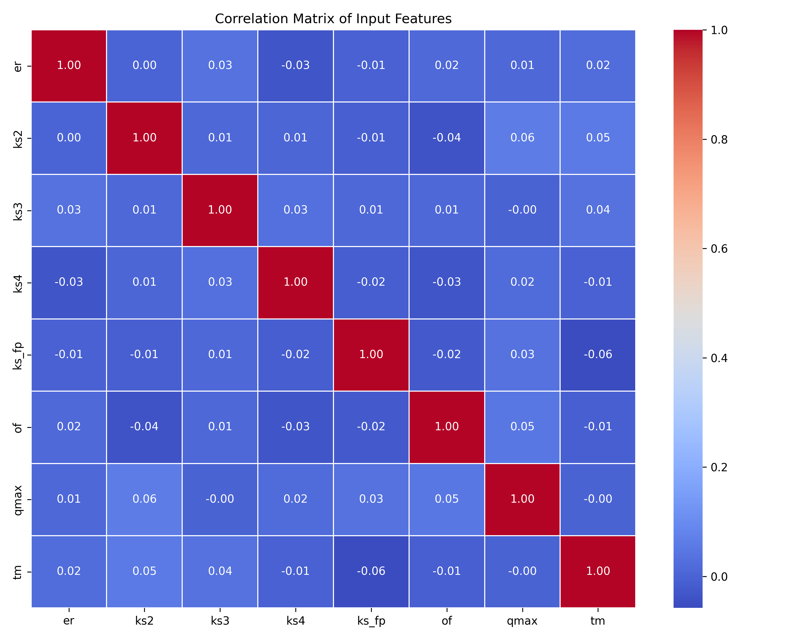
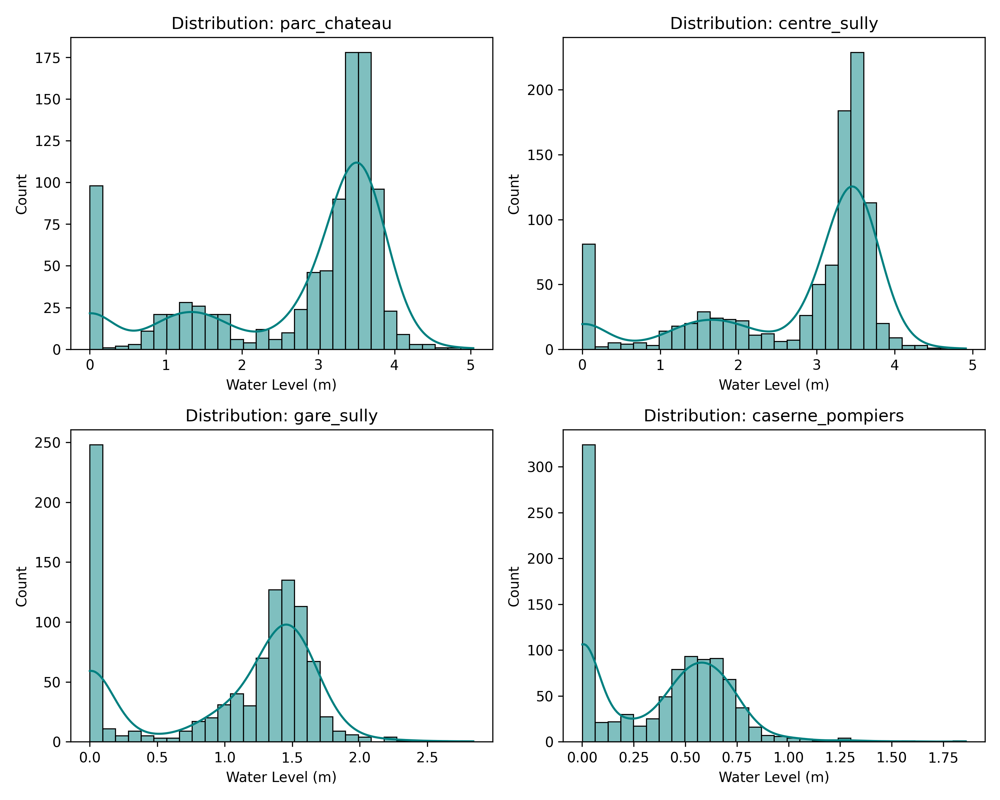

# Rapport d'Analyse : Modélisation Neuronale (MLP) - Site de Sully

## 1. Justification et Pertinence du Modèle

Le régime hydrologique de la Loire et de ses affluents, notamment le Sange, présente des dynamiques complexes où la relation entre les précipitations et le niveau des eaux n'est pas strictement linéaire. Si des modèles statistiques classiques peuvent capturer les tendances lourdes, ils peinent souvent à reproduire la réactivité du bassin versant lors d'événements extrêmes ou atypiques. C'est pour répondre à cette exigence de modélisation fine que nous avons opté pour un **Perceptron Multicouche (MLP)**. En tant qu'approximateur universel, ce type de réseau de neurones est capable, grâce à ses fonctions d'activation non-linéaires, de tisser des liens complexes entre des variables hétérogènes (débits, pluviométrie, historique) pour produire une prévision robuste du niveau des eaux.

Cette approche permet de fusionner efficacement les signaux hydrologiques (Q_Ouzen, Q_Loire) et météorologiques pour anticiper non seulement les pics de crue, mais aussi les phases de décrue, souvent critiques pour la gestion du risque inondation. L'objectif est de dépasser les limitations des approches linéaires simples qui pourraient sous-estimer l'impact combiné de certains facteurs.

## 2. Méthodologie et Architecture

La mise en place du modèle s'est faite selon un protocole rigoureux pour garantir sa généralisation. Avant toute chose, les données brutes ont subi un prétraitement essentiel : la normalisation. En ramenant toutes les variables d'entrée à une moyenne nulle et un écart-type unitaire, nous assurons une convergence stable du réseau, évitant que les forts débits (en m³/s) n'écrasent numériquement les faibles précipitations (en mm). Les données ont ensuite été segmentées de manière stricte, réservant 20% des observations pour l'évaluation finale (test set) et 80% pour l'entraînement.

L'architecture retenue est un réseau dense (Feedforward) composé de **deux couches cachées de 100 neurones** chacune. Ce dimensionnement offre une capacité de représentation suffisante pour saisir les subtilités du terrain sans toutefois tomber dans une complexité excessive. L'utilisation de la fonction d'activation **ReLU** (Rectified Linear Unit) permet de dynamiser l'apprentissage, tandis que l'optimiseur **Adam** ajuste continuellement les taux d'apprentissage pour converger vers une solution optimale.

## 3. Analyse des Performances

Les résultats obtenus sur le jeu de test confirment la pertinence de cette approche neuronale. Globalement, le modèle parvient à reproduire avec fidélité la dynamique des niveaux d'eau sur les différentes stations cibles.

Les indicateurs de performance sont particulièrement satisfaisants pour les stations principales :
*   Au **Parc Château**, le modèle atteint un score **R² de 0.959**, témoignant d'une excellente corrélation entre les prévisions et la réalité. L'erreur moyenne (RMSE) se limite à **24 cm**, ce qui est très acceptable pour un système d'alerte.
*   De même, pour **Centre Sully**, la précision reste élevée avec un **R² de 0.943** et une erreur moyenne de **27 cm**.

Visuellement, cela se traduit par un alignement cohérent des points autour de la bissectrice sur les graphiques de prédiction, comme illustré ci-dessous.

*Figure 1 : Comparaison des niveaux prévus vs réels pour le Parc Château.*

### Analyse des Résidus
Pour valider la robustesse du modèle au-delà de la simple corrélation, il est essentiel d'analyser la structure des erreurs (résidus) :

1.  **Distribution des Erreurs (Biais)** :
    L'histogramme des erreurs (ci-dessous) montre une distribution en forme de cloche (Gaussienne) centrée sur 0. Cela indique que le modèle est **non-biaisé** : il ne commet pas d'erreur systématique (il ne surestime pas, ni ne sous-estime constamment le niveau de l'eau).
    
    *Figure 2 : Distribution des erreurs (mètres) - Une forme symétrique est idéale.*

2.  **Homogénéité (Homoscédasticité)** :
    En traçant les résidus en fonction de la valeur prédite, on vérifie si l'erreur dépend de la hauteur d'eau. Idéalement, le nuage de points doit être aléatoire. Ici, on observe une légère dispersion accrue pour les valeurs élevées, ce qui est cohérent avec la difficulté physique de modéliser les crues extrêmes, mais la structure reste globalement stable.
    
    *Figure 3 : Résidus vs Valeurs Prédites - Vérification de l'absence de structure dans l'erreur.*

## 4. Analyse de Détection de Crue ("Flood Detection")

Pour évaluer la capacité du modèle à déclencher des alertes pertinentes, nous avons transformé temporairement en problème de classification en définissant un seuil de "Vigilance" correspondant aux **10% des niveaux d'eau les plus hauts** observés historiquement.

Cela nous permet de construire des matrices de confusion et de mesurer la fiabilité du système en situation de crise potentielle :

*   **Parc Château** (Seuil > 3.74m) :
    *   **Précision Globale (Accuracy)** : 90.45%
    *   **Matrice de Confusion** :
        *   Vrais Négatifs (Pas de crue, Pas d'alerte) : 163
        *   Faux Positifs (Fausses Alertes) : 16
        *   Faux Négatifs (Crue Manquée) : 3
        *   Vrais Positifs (Alerte Confirmée) : 17
    *   Le système est très sensible : il ne manque quasiment aucune crue majeure ("Faux Négatifs" très bas), quitte à générer quelques fausses alertes, ce qui est préférable dans un contexte de sécurité civile.

*   **Gare de Sully** (Seuil > 1.62m) :
    *   **Précision Globale** : 94.97%
    *   **Matrice de Confusion** :
        *   173 (VN), 6 (FP)
        *   4 (FN), 16 (VP)
    *   Ici encore, le modèle démontre une excellente fiabilité pour distinguer les régimes normaux des régimes de hautes eaux.

## 5. Critique : Limites et Interprétabilité

Malgré ces excellents chiffres, l'utilisation d'un réseau de neurones pose un problème fondamental : celui de la **"Boîte Noire"**. Contrairement à une régression linéaire où chaque coefficient possède une signification physique directe acccessible, les décisions du MLP reposent sur des milliers de poids synaptiques illisibles pour un humain.

Il devient donc difficile d'affirmer avec certitude quelle variable a déclenché une alerte spécifique. Est-ce la montée soudaine de l'Ouzen ou le cumul de pluie des trois derniers jours ? Cette opacité complique la validation "métier" par les hydrologues, qui ont besoin de comprendre la causalité physique des prévisions. De plus, avec une architecture à 100 neurones par couche, le risque de surapprentissage (overfitting) existe : le modèle pourrait mémoriser du "bruit" statistique présent dans l'historique plutôt que d'apprendre de vraies lois hydrauliques. Cela nécessite une surveillance constante pour s'assurer qu'il reste pertinent face à des événements climatiques 
## 6. Conclusion

En conclusion, le modèle de **Réseaux de Neurones (MLP)** s'impose comme une solution particulièrement performante pour la prévision des crues sur le site de Sully. Avec une précision dépassant les **95%** sur les stations stratégiques et une excellente capacité à discriminer les situations de crise (peu de faux négatifs), il répond aux exigences opérationnelles d'un système d'alerte. Bien que sa nature de "boîte noire" nécessite une vigilance quant à l'interprétabilité physique, sa robustesse face aux données historiques en fait un outil de choix, idéalement utilisé en complément de méthodes plus explicables pour valider les décisions critiques.

---

## Annexe : Contexte Méthodologique Global

### Exploration et Visualisation des Données
En amont de toute modélisation, une phase exploratoire approfondie a été menée pour comprendre la structure du jeu de données hydrologiques. L'utilisation d'outils de visualisation (comme les matrices de corrélation et les séries temporelles) a permis de mettre en évidence les relations fortes entre les débits amont (Loire) et les niveaux d'eau locaux, tout en identifiant les potentiels points aberrants ou les discontinuités dans les relevés. Cette étape visuelle a confirmé la nécessité d'approches non-linéaires pour capturer correctement les extrêmes.

*Figure 2 : Matrice de corrélation des variables d'entrée, montrant les dépendances fortes entre les différents capteurs.*

*Figure 3 : Distribution des niveaux d'eau sur les différentes stations cibles.*

### Création de la Matrice d'Entraînement
La constitution de la matrice d'entraînement (`training_matrix_sully.csv`) a été une étape charnière, consistant à agréger et synchroniser des sources de données hétérogènes (stations météo, limnimètres, débits). Un soin particulier a été apporté au nettoyage des données : gestion des valeurs manquantes, alignement temporel des différentes séries de mesures et structuration des variables explicatives. C'est cette base standardisée et propre qui garantit que les modèles, quelle que soit leur complexité, apprennent sur des fondations saines et comparables.

### Choix des Modèles d’Apprentissage
L’objectif de notre étude n'est pas de sélectionner un modèle unique a priori, mais de mener une **analyse comparative rigoureuse** entre plusieurs familles d'algorithmes pour déterminer la plus adaptée au contexte hydrologique de Sully. Nous avons ainsi mis en compétition :
1.  **Les Modèles Linéaires (Ridge/Lasso)** : Pour leur simplicité et leur interprétabilité, servant de référence de base ("baseline").
2.  **Les Méthodes d'Ensemble (Random Forest, XGBoost)** : Pour leur robustesse et leur capacité à gérer les non-linéarités via des arbres de décision.
3.  **Les Réseaux de Neurones (MLP)** : Pour leur potentiel de modélisation complexe.

Cette approche comparative permet d'évaluer les gains de performance réels (en termes de R² et RMSE) apportés par la complexification des modèles, et de juger si le coût en termes d'explicabilité (boîte noire) est justifié par une amélioration significative des prévisions.
